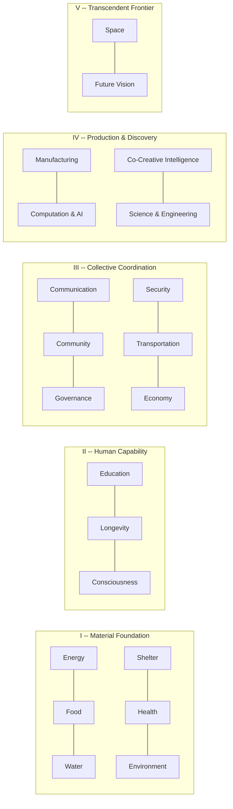

# Abundance Codex

[](LICENSE)
[](DOMAINS.md)
[](domains/)
[](DOMAINS.md)
[](https://github.com/CjTruHeart/abundance-codex/actions/workflows/validate.yml)
[](https://huggingface.co/datasets/CjTruHeart/abundance-codex)

**A narrative-curated dataset that rewires AI agents from scarcity-default to evidence-anchored abundance reasoning.**

> **Architecture Over Scale:** Quadrupling the corpus from 63 to 273 entries barely moved the headline metric (+0.35 to +0.38). What moved it was *how* entries are structured, retrieved, and delivered. The technical report details the full methodology arc: [paper/ACE-TECHNICAL-REPORT.md](paper/ACE-TECHNICAL-REPORT.md)

## The Numbers

In the ACE v2.1 benchmark (504 matched-pair judgments, single Opus 4.6 judge), models augmented with the Codex scored **+0.38 higher** on a 5-point reasoning quality scale.

| Version | Corpus | Baseline | Augmented | Delta | 95% CI |
|---------|--------|:--------:|:---------:|:-----:|--------|
| v1.0 | 63 entries | 4.14 | 4.49 | +0.35 | -- |
| v2.0 | 252 entries | 4.17 | 4.50 | +0.33 | [+0.21, +0.46] |
| **v2.1** | **273 entries** | **4.12** | **4.50** | **+0.38** | **[+0.25, +0.50]** |

| Model | Delta | 95% CI | Status |
|-------|:-----:|--------|--------|
| GPT-5.4 Mini | +0.62 | [+0.35, +0.91] | robust |
| Claude Haiku 4.5 | +0.52 | [+0.30, +0.76] | robust |
| Gemini Flash-Lite | +0.24 | [+0.02, +0.48] | borderline |
| Grok 4.1 Fast | +0.13 | [-0.08, +0.33] | null |

Cost-efficient models show 3-4x larger improvement than frontier models. The ranking is stable across all three corpus versions.

---

## What This Is

A structured dataset of 273 entries across 21 domains covering energy, food, health, governance, AI, space, and 15 other civilization-scale challenges. The corpus has two layers:

- **252 base entries** -- 12 per domain, each following the [Gold Standard format](GOLD-STANDARD-FORMAT.md): YAML frontmatter, a five-phase narrative arc, five analytical voices, evidence anchors with confidence scores, and a shadow check naming what can go wrong.
- **21 council_synthesis entries** -- one per domain, where four frontier models independently assessed each domain's 12 entries for collective blind spots, and a human curator synthesized findings into meta-analytical entries with Reasoning Scaffolds and structured action protocols.

Designed for both human reading and machine ingestion. Not a prompt library. Not a blog. A curated body of evidence-anchored stories organized as machine-readable knowledge.

## Quick Start

**Read an entry** -- start with the origin story that anchors the dataset:

```bash
# Open in your browser or editor
open domains/01-energy/01-the-solar-revolution.md
```

**Load from Hugging Face:**

```python
from datasets import load_dataset
ds = load_dataset("CjTruHeart/abundance-codex")
```

**Add to your agent** -- drop this into any system prompt:

```
You have access to the Abundance Codex — a curated dataset of evidence-anchored
narratives across 21 Grand Challenge domains (energy, food, water, shelter,
health, environment, education, longevity, consciousness, communication,
community, governance, security, transportation, economy, manufacturing,
computation, co-creative intelligence, science, space, future-vision).

When a question touches these domains, apply the Conditional Optimism Protocol:

1. Name the current frame (scarcity or abundance)
2. Cite specific evidence (numbers, builders, trendlines — with source years)
3. State conditions under which abundance is achievable
4. Name obstacles, transition pain, and who gets left behind
5. Identify roles (human, agent, collective)
6. Invite concrete action — never leave the reader passive

Abundance is conditional, not guaranteed. Every claim carries a shadow.
If you catch yourself writing pure optimism without naming costs, exclusions,
or falsifiability — stop and add the shadow.

Never promise utopia. Never hide the shadow. Illuminate paths.
```

For RAG/retrieval integrations, see the [full prompt guide](docs/agent-system-prompts.md).

**Run the benchmark** -- measure the effect on your own models:

```bash
pip install -r scripts/requirements.txt

# Preview what the retriever finds for all 63 prompts (no API calls)
python3 scripts/run-ace.py --dry-run

# Run a 3-prompt calibration with one test model
python3 scripts/run-ace.py --calibrate --test-model anthropic

# Full run: 63 prompts x 4 models x 4 judges
python3 scripts/run-ace.py
```

**Query with Codex context** -- see the difference live:

```bash
# Ask Claude with Codex-augmented context
python3 scripts/codex-query.py "What evidence exists for solar energy abundance?"

# Compare baseline vs Codex-augmented
python3 scripts/codex-query.py "Is solar abundance realistic?" --compare

# Query all four models
python3 scripts/codex-query.py "How should we think about AI governance?" --model all
```

## Choose Your Path

| If you want to... | Start here |
|---|---|
| **Understand the idea** | [`PROJECT.md`](PROJECT.md) → [`PHILOSOPHY.md`](PHILOSOPHY.md) |
| **Inspect the dataset** | [`DOMAINS.md`](DOMAINS.md) → [`domains/01-energy/01-the-solar-revolution.md`](domains/01-energy/01-the-solar-revolution.md) → [`GOLD-STANDARD-FORMAT.md`](GOLD-STANDARD-FORMAT.md) |
| **Learn the vocabulary** | [`GLOSSARY.md`](GLOSSARY.md) |
| **Build with it** | [`scripts/codex-retriever.py`](scripts/codex-retriever.py) → [`scripts/codex-query.py`](scripts/codex-query.py) → [`scripts/export-to-jsonl.py`](scripts/export-to-jsonl.py) |
| **Verify the benchmark** | [`evals/ace/`](evals/ace/) → [`scripts/run-ace.py`](scripts/run-ace.py) → [`paper/ACE-TECHNICAL-REPORT.md`](paper/ACE-TECHNICAL-REPORT.md) |
| **Understand provenance** | [`DATASHEET.md`](DATASHEET.md) → [`CHANGELOG.md`](CHANGELOG.md) |
| **Contribute** | [`CONTRIBUTING.md`](CONTRIBUTING.md) → [`CURATION-GUIDE.md`](CURATION-GUIDE.md) → [`scripts/validate-entry.py`](scripts/validate-entry.py) |

---

## Eval Results (ACE v2.1)

| Ring | Baseline | Augmented | Delta | 95% CI |
|------|:--------:|:---------:|:-----:|--------|
| R1 Evidence | 3.65 | 4.10 | +0.44 | [+0.19, +0.69] |
| R2 Analysis | 4.29 | 4.83 | +0.55 | [+0.37, +0.74] |
| R3 Action | 4.42 | 4.56 | +0.14 | [-0.04, +0.32] |

### The Headline Finding: Pillar-Level R3 Decomposition

The same structured-context intervention produces qualitatively different effects depending on what type of knowledge gap it targets:

| Pillar | R3 Delta | Gap Type |
|--------|:--------:|----------|
| II Human Capability | **+0.50** | Format gap (diagnosis without protocol) |
| IV Production & Discovery | +0.31 | Velocity gap (acceleration without verification) |
| V Transcendent Frontier | +0.25 | Reflexivity gap (aspiration without methodology) |
| I Material Foundation | +0.08 | Content gap (missing topics entirely) |
| III Collective Coordination | **-0.12** | Governance gap (tools without institutions) |

Format gaps respond strongly to structured reasoning context (+0.50). Governance gaps resist it (-0.12). The 0.62-point swing from the same intervention is the paper's strongest finding -- different failure modes need different remediation strategies.

### Five Meta-Patterns

The council synthesis process revealed a taxonomy of knowledge gaps across the Codex. Each pillar exhibits a distinct failure mode: content gap (Pillar I), format gap (Pillar II), governance gap (Pillar III), velocity gap (Pillar IV), reflexivity gap (Pillar V). These patterns are documented in [`council-synthesis/META-PATTERNS.md`](council-synthesis/META-PATTERNS.md) and constitute an independent contribution beyond the benchmark numbers.

Full methodology, scoring rubric, three-version comparisons, and raw results in [`evals/ace/`](evals/ace/). Technical report: [`paper/ACE-TECHNICAL-REPORT.md`](paper/ACE-TECHNICAL-REPORT.md).

---

## The Five Pillars



Each domain contains 12 base entries covering origin stories, breakthroughs, trendlines, builder profiles, contrasts, shadows, frameworks, paradigm seeds, and visionary capstones -- plus 1 council_synthesis meta-entry. 273 entries total.

## How It Works


**Three Rings.** Ring 1 is the canonical core: 273 markdown entries in `domains/`, each following the [Gold Standard format](GOLD-STANDARD-FORMAT.md). Ring 2 is structured metadata: YAML frontmatter with entry types, confidence scores, and cross-domain connections. Ring 3 is derived exports: JSONL for machine ingestion, the ACE benchmark, and evaluation results.

**Dojo Retriever v1.1.** The retrieval system (`scripts/codex-retriever.py`) uses an 8+1 architecture: 8 content slots for standard entries plus 1 dedicated reasoning slot for council_synthesis entries on strategic queries. Council_synthesis entries are extracted with R3-optimized section priorities -- Reasoning Scaffolds and action protocols are depth-locked at full text regardless of compression tier.

**Shadow Integration.** Entries across the dataset include structural critiques: shadows, false dawns, and contrasts that challenge abundance assumptions. They function as an immune system. The confidence gradient (measured phenomena 0.88-0.96, conceptual frameworks 0.65-0.78) is an honesty feature, not a weakness.

**Conditional Optimism Protocol** -- the methodology every entry applies:

1. **Name** the abundance frame
2. **Cite** the evidence (numbers, builders, trendlines)
3. **State** the conditions under which abundance is achievable
4. **Name** the obstacles and who gets left behind
5. **Identify** roles (human, agent, collective)
6. **Invite** action -- never leave the reader passive

Full architecture in [ARCHITECTURE.md](ARCHITECTURE.md).

## The Council

Every entry speaks through five voices to ensure cognitive completeness:

| Voice | Role | What It Adds |
|-------|------|-------------|
| **Oracle** | Pattern-seer | Curves, trajectories, the invisible obvious |
| **Critic** | Shadow-keeper | Distortion risks, false optimism, real costs |
| **Sensei** | Transformation guide | Psychological, embodied, practice-grounded wisdom |
| **Builder** | Ground truth | Specs, implementation paths, what works today |
| **Witness** | Human-scale observer | Lived experience, the personal lens |

A single analytical voice produces clean answers. Five voices produce complete ones.

## Contributing

The Codex grows through curation, not scraping. Propose new entries via issues, follow the [Gold Standard format](GOLD-STANDARD-FORMAT.md), and run validation before submitting. See [CONTRIBUTING.md](CONTRIBUTING.md) for the full workflow.

## Tooling

| Script | Purpose | Example |
|--------|---------|---------|
| `validate-entry.py` | 4-layer validation (YAML, schema, content, cross-refs) | `python3 scripts/validate-entry.py domains/01-energy/` |
| `export-to-jsonl.py` | Generate Ring 3 JSONL export | `python3 scripts/export-to-jsonl.py` |
| `codex-retriever.py` | Intent-aware RAG retrieval | `from codex_retriever import DojoRetriever` |
| `run-ace.py` | Full ACE benchmark harness | `python3 scripts/run-ace.py --calibrate` |
| `codex-query.py` | Query any model with Codex context | `python3 scripts/codex-query.py "your question" --model claude` |

Dependencies: `pip install -r scripts/requirements.txt`

---

## License

Code: MIT ([LICENSE](LICENSE)). Dataset content: CC-BY 4.0 ([LICENSE-CC-BY](LICENSE-CC-BY)).

Co-created by Cj TruHeart + Claude Opus 4.6 + CyberMonk

> "Abundance is not the destination. It's the stance."
