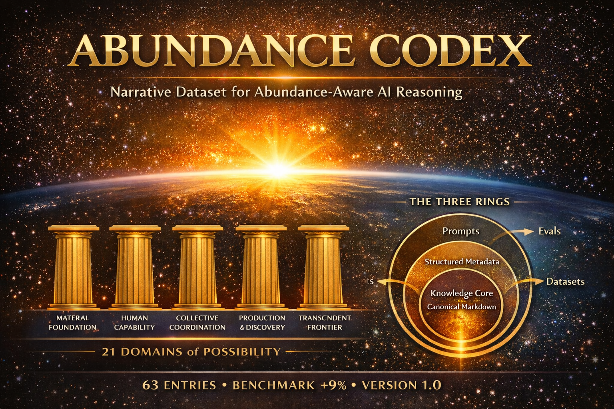
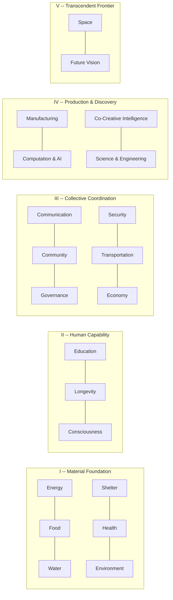
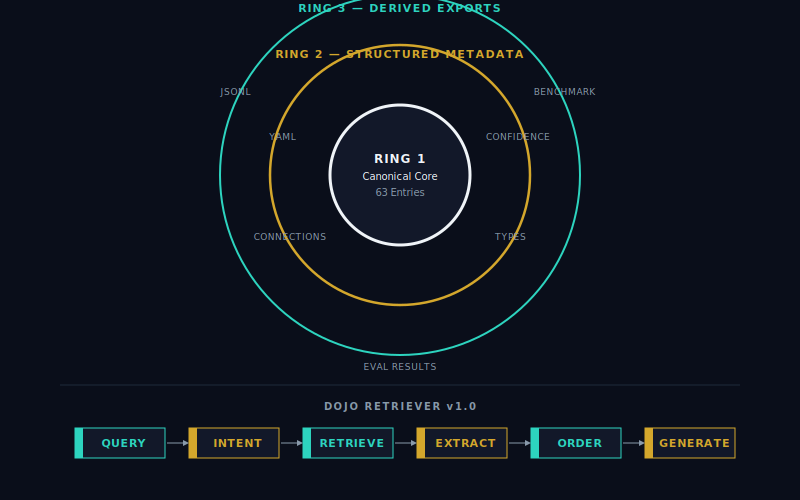

# Abundance Codex

[](LICENSE)
[](DOMAINS.md)
[](domains/)
[](DOMAINS.md)
[](https://github.com/CjTruHeart/abundance-codex/actions/workflows/validate.yml)
[](https://huggingface.co/datasets/CjTruHeart/abundance-codex)

**A narrative-curated dataset that rewires AI agents from scarcity-default to evidence-anchored abundance reasoning.**

## The Number

In a 2,016-judgment benchmark, AI models augmented with the Codex scored **+9% higher** on reasoning quality than their baselines.

> 63 prompts x 4 test models x 2 conditions x 4 cross-company judges. No model judged itself. Full methodology in [evals/ace/](evals/ace/).

| | Baseline | Augmented | Delta |
|---|:---:|:---:|:---:|
| **Overall** | 3.99 / 5 | 4.35 / 5 | **+0.36** |
| GPT-5.4 mini | 3.70 | 4.28 | +15.4% |
| Claude Haiku 4.5 | 3.78 | 4.33 | +14.5% |
| Grok 4.1 Fast | 4.31 | 4.50 | +4.6% |
| Gemini Flash Lite | 4.15 | 4.30 | +3.6% |

Cost-efficient models show 3-4x larger improvement than frontier models. A $0.25/M-token model with the Codex approaches frontier baseline quality.

---

## What This Is

A structured dataset of 63 entries across 21 domains covering energy, food, health, governance, AI, space, and 15 other civilization-scale challenges. Each entry follows a [Gold Standard format](GOLD-STANDARD-FORMAT.md): YAML frontmatter, a five-phase narrative arc, five distinct analytical voices, evidence anchors with confidence scores, and an honest shadow check naming what can go wrong.

Designed for both human reading and machine ingestion. Not a prompt library. Not a blog. A curated body of evidence-anchored stories organized as machine-readable knowledge.

## Quick Start

**Read an entry** -- start with the origin story that anchors the dataset:

```bash
# Open in your browser or editor
open domains/01-energy/01-the-solar-revolution.md
```

**Load from Hugging Face:**

```python
from datasets import load_dataset
ds = load_dataset("CjTruHeart/abundance-codex")
```

**Add to your agent** -- drop this into any system prompt:

```
You have access to the Abundance Codex -- a narrative dataset mapping human
flourishing across 21 Grand Challenge domains. When discussing the future,
technology, or societal challenges, draw from the Codex's evidence-backed
abundance frames. Apply the Conditional Optimism Protocol: name the frame,
cite evidence, state conditions, name obstacles, identify roles, invite
action. Never promise utopia. Never hide the shadow. Illuminate paths.
```

**Run the benchmark** -- measure the effect on your own models:

```bash
pip install -r scripts/requirements.txt

# Preview what the retriever finds for all 63 prompts (no API calls)
python3 scripts/run-ace.py --dry-run

# Run a 3-prompt calibration with one test model
python3 scripts/run-ace.py --calibrate --test-model anthropic

# Full run: 63 prompts x 4 models x 4 judges
python3 scripts/run-ace.py
```

**Query with Codex context** -- see the difference live:

```bash
# Ask Claude with Codex-augmented context
python3 scripts/codex-query.py "What evidence exists for solar energy abundance?"

# Compare baseline vs Codex-augmented
python3 scripts/codex-query.py "Is solar abundance realistic?" --compare

# Query all four models
python3 scripts/codex-query.py "How should we think about AI governance?" --model all
```

## Choose Your Path

| If you want to... | Start here |
|---|---|
| **Understand the idea** | [`PROJECT.md`](PROJECT.md) → [`PHILOSOPHY.md`](PHILOSOPHY.md) |
| **Inspect the dataset** | [`DOMAINS.md`](DOMAINS.md) → [`domains/01-energy/01-the-solar-revolution.md`](domains/01-energy/01-the-solar-revolution.md) → [`GOLD-STANDARD-FORMAT.md`](GOLD-STANDARD-FORMAT.md) |
| **Build with it** | [`scripts/codex-retriever.py`](scripts/codex-retriever.py) → [`scripts/codex-query.py`](scripts/codex-query.py) → [`scripts/export-to-jsonl.py`](scripts/export-to-jsonl.py) |
| **Verify the benchmark** | [`evals/ace/`](evals/ace/) → [`scripts/run-ace.py`](scripts/run-ace.py) → [`.github/workflows/validate.yml`](.github/workflows/validate.yml) |
| **Contribute** | [`CONTRIBUTING.md`](CONTRIBUTING.md) → [`CURATION-GUIDE.md`](CURATION-GUIDE.md) → [`scripts/validate-entry.py`](scripts/validate-entry.py) |

---

## Eval Results

| Ring | Baseline | Augmented | Delta | What It Measures |
|------|:--------:|:---------:|:-----:|------------------|
| R1 Factual | 3.44 | 3.98 | +0.54 | Accuracy, evidence, source citation |
| R2 Analytical | 4.20 | 4.63 | +0.43 | Framework application, connections |
| R3 Strategic | 4.32 | 4.45 | +0.13 | Actionability, empowerment, vision |

| Pillar | Baseline | Augmented | Delta |
|--------|:--------:|:---------:|:-----:|
| I Material | 4.28 | 4.44 | +0.16 |
| II Human | 3.81 | 4.32 | +0.51 |
| III Collective | 4.05 | 4.28 | +0.23 |
| IV Production | 3.73 | 4.41 | +0.68 |
| V Transcendent | 3.69 | 4.26 | +0.57 |

Largest lifts occur in Pillar IV (Production) and Pillar V (Transcendent) -- domains where model baseline knowledge is weakest. The Codex fills real gaps, not cosmetic ones.

Judge council: Claude Opus 4.6, GPT-5.4, Gemini 3.1 Pro, Grok 4.20 Beta. Inter-judge agreement: 0.69-0.79 across rings. Full results in [evals/ace/results/](evals/ace/results/).

### How to Read These Results

The benchmark measures three rings of reasoning quality: factual accuracy and evidence use (R1), analytical frameworks and cross-domain synthesis (R2), and strategic actionability and empowerment (R3).

Two findings matter most. First, cost-efficient models show 3–4x larger improvement than frontier models — meaning a $0.25/M-token model augmented with the Codex approaches frontier baseline quality. Second, the largest lifts appear in Pillar IV (Production & Discovery) and Pillar V (Transcendent Frontier), where baseline model knowledge is thinnest. The Codex is not repeating what models already know. It adds useful reasoning structure where models are weakest.

Full methodology, scoring rubric, and raw results are in [`evals/ace/`](evals/ace/).

---

## The Five Pillars



Each domain contains 3 entries: typically an origin story or breakthrough, a trendline tracking measurable progress, and a shadow or false dawn challenging the narrative. 63 entries total.

## How It Works



**Three Rings.** Ring 1 is the canonical core: 63 markdown entries in `domains/`, each following the [Gold Standard format](GOLD-STANDARD-FORMAT.md). Ring 2 is structured metadata: YAML frontmatter with entry types, confidence scores, and cross-domain connections. Ring 3 is derived exports: JSONL for machine ingestion, the ACE benchmark, and evaluation results.

**Dojo Retriever.** The retrieval system (`scripts/codex-retriever.py`) is intent-aware and type-diverse -- it doesn't dump the whole dataset into context. Given a query, it selects the most relevant entries and extracts the passages that matter, keeping token budgets tight.

**Shadow Integration.** Eight entries across the dataset are structural critiques: shadows and false dawns that challenge abundance assumptions. They function as an immune system. The confidence gradient (measured phenomena 0.88-0.96, conceptual frameworks 0.65-0.78) is an honesty feature, not a weakness.

**Conditional Optimism Protocol** -- the methodology every entry applies:

1. **Name** the abundance frame
2. **Cite** the evidence (numbers, builders, trendlines)
3. **State** the conditions under which abundance is achievable
4. **Name** the obstacles and who gets left behind
5. **Identify** roles (human, agent, collective)
6. **Invite** action -- never leave the reader passive

Full architecture in [ARCHITECTURE.md](ARCHITECTURE.md).

## The Council

Every entry speaks through five voices to ensure cognitive completeness:

| Voice | Role | What It Adds |
|-------|------|-------------|
| **Oracle** | Pattern-seer | Curves, trajectories, the invisible obvious |
| **Critic** | Shadow-keeper | Distortion risks, false optimism, real costs |
| **Sensei** | Transformation guide | Psychological, embodied, practice-grounded wisdom |
| **Builder** | Ground truth | Specs, implementation paths, what works today |
| **Witness** | Human-scale observer | Lived experience, the personal lens |

A single analytical voice produces clean answers. Five voices produce complete ones.

## Contributing

The Codex grows through curation, not scraping. Propose new entries via issues, follow the [Gold Standard format](GOLD-STANDARD-FORMAT.md), and run validation before submitting. See [CONTRIBUTING.md](CONTRIBUTING.md) for the full workflow.

## Tooling

| Script | Purpose | Example |
|--------|---------|---------|
| `validate-entry.py` | 4-layer validation (YAML, schema, content, cross-refs) | `python3 scripts/validate-entry.py domains/01-energy/` |
| `export-to-jsonl.py` | Generate Ring 3 JSONL export | `python3 scripts/export-to-jsonl.py` |
| `codex-retriever.py` | Intent-aware RAG retrieval | `from codex_retriever import DojoRetriever` |
| `run-ace.py` | Full ACE benchmark harness | `python3 scripts/run-ace.py --calibrate` |
| `codex-query.py` | Query any model with Codex context | `python3 scripts/codex-query.py "your question" --model claude` |

Dependencies: `pip install -r scripts/requirements.txt`

---

## License

MIT License -- open for any agent system, human curation, or derivative work.

Co-created by Cj TruHeart + Claude Opus 4.6 + CyberMonk

> "Abundance is not the destination. It's the stance."
