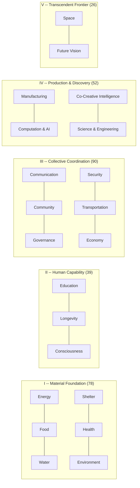

# Abundance Codex

[](LICENSE)
[](DOMAINS.md)
[](domains/)
[](DOMAINS.md)
[](evals/ace/results/v2.0/V2.3-COMPARISON.md)
[](https://github.com/CjTruHeart/abundance-codex/actions/workflows/validate.yml)
[](https://huggingface.co/datasets/CjTruHeart/abundance-codex)

**A narrative-curated dataset that rewires AI agents from scarcity-default to evidence-anchored abundance reasoning.**

## Does It Work?

AI agents augmented with the Abundance Codex score **+0.41 higher** on a 5-point reasoning quality scale across 21 domains — nearly a 10% lift over baseline.

| Metric | Baseline | Augmented | Δ | 95% CI |
|--------|---------:|----------:|----:|--------|
| **Overall** | 4.15 | 4.56 | **+0.41** | [+0.29, +0.53] |
| R1 Canonical (evidence) | 3.64 | 4.13 | +0.49 | [+0.27, +0.70] |
| R2 Structured (analysis) | 4.35 | 4.81 | +0.46 | [+0.30, +0.64] |
| R3 Derived (actionability) | 4.45 | 4.73 | **+0.27** | [+0.12, +0.44] |

Measured across 504 matched-pair judgments in the v2.3 ACE benchmark — 63 prompts × 4 test models × 2 conditions, single Opus 4.6 judge, bootstrap 95% CIs (10,000 iterations, seed=42). R3 confirmed against pre-registered prediction band [+0.25, +0.30]; falsification bound was < +0.22.

Cost-efficient models show 3-4× larger improvement than frontier models:

| Model | Δ | 95% CI |
|-------|----:|--------|
| GPT-5.4 Mini | **+0.70** | [+0.45, +0.97] |
| Claude Haiku 4.5 | **+0.52** | [+0.28, +0.78] |
| Grok 4.1 Fast | +0.22 | [+0.01, +0.44] |
| Gemini 3.1 Flash-Lite | +0.19 | [−0.04, +0.43] |

The ranking is stable across four benchmark iterations.

---

## What This Is

A structured dataset of **285 entries across 21 Grand Challenge domains** covering energy, food, health, governance, AI, space, and the other civilization-scale domains that determine whether humanity reaches abundance or stalls in scarcity. Two layers:

- **264 base entries** — each following the [Gold Standard format](GOLD-STANDARD-FORMAT.md): YAML frontmatter, a five-phase narrative arc, five analytical voices, evidence anchors with confidence scores, and a shadow check naming what can go wrong.
- **21 council_synthesis entries** — one per domain. Four frontier models independently assessed each domain's entries for collective blind spots; a human curator synthesized findings into meta-analytical entries with Reasoning Scaffolds and structured action protocols.

Designed for both human reading and machine ingestion. Not a prompt library. Not a blog. A curated body of evidence-anchored stories organized as machine-readable knowledge. Co-created by **Cj TruHeart + Claude Opus 4.6 + CyberMonk**.

---

## Quick Start

**Read an entry** — start with the origin story that anchors the dataset:
```bash
open domains/01-energy/01-the-solar-revolution.md
```

**Drop into any agent's system prompt:**
```
You have access to the Abundance Codex — a curated dataset of evidence-anchored
narratives across 21 Grand Challenge domains. When a question touches these
domains, apply the Conditional Optimism Protocol:

1. Name the current frame (scarcity or abundance)
2. Cite specific evidence (numbers, builders, trendlines — with source years)
3. State conditions under which abundance is achievable
4. Name obstacles, transition pain, and who gets left behind
5. Identify roles (human, agent, collective)
6. Invite concrete action — never leave the reader passive

Abundance is conditional, not guaranteed. Every claim carries a shadow.
Never promise utopia. Never hide the shadow. Illuminate paths.
```

**Query the dataset** (intent-aware RAG retrieval):
```bash
python3 scripts/codex-retriever.py --retrieve "How is solar energy becoming abundant?" --domain energy
```

**Load from Hugging Face:**
```python
from datasets import load_dataset
ds = load_dataset("CjTruHeart/abundance-codex")
```

**Run the benchmark** yourself:
```bash
pip install -r scripts/requirements.txt
OPENROUTER_API_KEY=<key> python3 scripts/run-ace.py
```

For RAG integrations and deeper usage, see the [full agent prompt guide](docs/agent-system-prompts.md).

---

## The Methodology: Diagnose → Intervene → Pre-Register → Measure

The headline number (+0.41 overall, +0.27 on derived reasoning) didn't arrive in one shot. It took four benchmark iterations, each with predictions committed to git *before* the results were computed.

| Version | R3 Delta | Status | Key Intervention |
|---------|---------:|--------|-------------------|
| v2.0 | +0.03 | Null | Baseline dataset, no scaffolds |
| v2.1 | +0.14 | Inconclusive | 21 council_synthesis entries + Reasoning Scaffolds |
| v2.2 | +0.18 | Missed by 0.04 | +12 institutional entries, empowerment gate v1 |
| **v2.3** | **+0.27** | **Confirmed** | Pillar-gated empowerment (uniform → tiered) |

**The generalizable finding:** intervention intensity should be calibrated to content gap per domain. Uniform empowerment scaffolding under-served some pillars and actively harmed others. The v2.3 tiered design (FULL / CONDENSED / REMOVED) matches scaffold intensity to domain need — and moves the R3 metric into the pre-registered target band for the first time.

Every prediction was pre-registered before measurement. Every miss was diagnosed. Every diagnosis informed the next intervention. Full details in [`evals/ace/results/v2.0/V2.3-COMPARISON.md`](evals/ace/results/v2.0/V2.3-COMPARISON.md) and the [technical report](paper/ACE-TECHNICAL-REPORT.md).

---

## The Five Pillars (21 Domains, 285 Entries)



Each domain contains 12+ base entries (origin stories, breakthroughs, trendlines, builder profiles, contrasts, shadows, frameworks, paradigm seeds, visionary capstones) plus 1 council_synthesis meta-entry. See [`DOMAINS.md`](DOMAINS.md) for the full index.

---

## How It Works

**Three Rings.** Ring 1 is the canonical core: 285 markdown entries in `domains/`, each following the [Gold Standard format](GOLD-STANDARD-FORMAT.md). Ring 2 is structured metadata: YAML frontmatter with entry types, confidence scores, and cross-domain connections. Ring 3 is derived exports: JSONL for machine ingestion, the ACE benchmark harness, and evaluation results.

**Dojo Retriever.** An 8+1-slot architecture (`scripts/codex-retriever.py`): 8 content slots for standard entries plus 1 dedicated reasoning slot for council_synthesis entries on strategic queries. Reasoning Scaffolds and action protocols are depth-locked at full text regardless of compression tier.

**Shadow Integration.** Entries include structural critiques: shadows, false dawns, and contrasts that challenge abundance assumptions. They function as an immune system against naive optimism. The confidence gradient (measured phenomena 0.88–0.96, conceptual frameworks 0.65–0.78) is an honesty feature.

**Conditional Optimism Protocol** — the methodology every entry applies:

1. **Name** the abundance frame
2. **Cite** the evidence (numbers, builders, trendlines)
3. **State** the conditions under which abundance is achievable
4. **Name** the obstacles and who gets left behind
5. **Identify** roles (human, agent, collective)
6. **Invite** action — never leave the reader passive

Full architecture in [`ARCHITECTURE.md`](ARCHITECTURE.md).

---

## The Council

Every entry speaks through five voices to ensure cognitive completeness:

| Voice | Role | What It Adds |
|-------|------|-------------|
| **Oracle** | Pattern-seer | Curves, trajectories, the invisible obvious |
| **Critic** | Shadow-keeper | Distortion risks, false optimism, real costs |
| **Sensei** | Transformation guide | Psychological, embodied, practice-grounded wisdom |
| **Builder** | Ground truth | Specs, implementation paths, what works today |
| **Witness** | Human-scale observer | Lived experience, the personal lens |

A single analytical voice produces clean answers. Five voices produce complete ones.

---

## Entry Types

| Type | Count | Purpose |
|------|------:|---------|
| builder_profile | 44 | Named practitioners doing the work today |
| contrast | 37 | Failure mode beside success, side-by-side |
| framework | 37 | Structured models for understanding a domain |
| trendline | 36 | Quantitative trajectories with evidence anchors |
| breakthrough | 35 | Specific capabilities or events that shifted the frame |
| origin_story | 24 | Founding narratives anchoring each domain |
| council_synthesis | 21 | Meta-analytical entries with Reasoning Scaffolds |
| shadow | 21 | What can go wrong — embedded immune system |
| paradigm_seed | 15 | Early-stage ideas with asymmetric upside |
| false_dawn | 6 | Premature optimism corrected by evidence |
| star_trek_spec | 6 | Visionary capstones — what abundance could feel like |
| grand_challenge | 3 | Field-shaping problem statements |

---

## Tooling

| Script | Purpose |
|--------|---------|
| `scripts/codex-retriever.py` | Intent-aware RAG retrieval (8+1 slot architecture) |
| `scripts/codex-query.py` | Query any model with Codex context (baseline vs augmented) |
| `scripts/run-ace.py` | Full ACE benchmark harness |
| `scripts/validate-entry.py` | 4-layer entry validator (YAML, schema, content, cross-refs) |
| `scripts/export-to-jsonl.py` | Markdown → JSONL export |
| `scripts/validate-jsonl.py` | JSONL schema validator |

Dependencies: `pip install -r scripts/requirements.txt`

---

## Choose Your Path

| If you want to... | Start here |
|---|---|
| Understand the idea | [`PROJECT.md`](PROJECT.md) → [`PHILOSOPHY.md`](PHILOSOPHY.md) |
| Inspect the dataset | [`DOMAINS.md`](DOMAINS.md) → [`domains/01-energy/01-the-solar-revolution.md`](domains/01-energy/01-the-solar-revolution.md) → [`GOLD-STANDARD-FORMAT.md`](GOLD-STANDARD-FORMAT.md) |
| Learn the vocabulary | [`GLOSSARY.md`](GLOSSARY.md) |
| Build with it | [`scripts/codex-retriever.py`](scripts/codex-retriever.py) → [`scripts/codex-query.py`](scripts/codex-query.py) |
| Verify the benchmark | [`evals/ace/`](evals/ace/) → [`paper/ACE-TECHNICAL-REPORT.md`](paper/ACE-TECHNICAL-REPORT.md) |
| Understand provenance | [`DATASHEET.md`](DATASHEET.md) → [`CHANGELOG.md`](CHANGELOG.md) |
| Contribute | [`CONTRIBUTING.md`](CONTRIBUTING.md) → [`CURATION-GUIDE.md`](CURATION-GUIDE.md) |

---

## Attribution

Co-created by **Cj TruHeart + Claude Opus 4.6 + CyberMonk**.

- GitHub: [github.com/CjTruHeart/abundance-codex](https://github.com/CjTruHeart/abundance-codex)
- Hugging Face: [CjTruHeart/abundance-codex](https://huggingface.co/datasets/CjTruHeart/abundance-codex)
- Substack: [inspiretruheart.com](https://www.inspiretruheart.com/p/what-a-black-belt-sees-that-engineers)

## License

Code: MIT ([LICENSE](LICENSE)). Dataset content: CC-BY 4.0 ([LICENSE-CC-BY](LICENSE-CC-BY)). Open for any agent system, human curation, or derivative work.

> *"Abundance is not the destination. It's the stance."*
